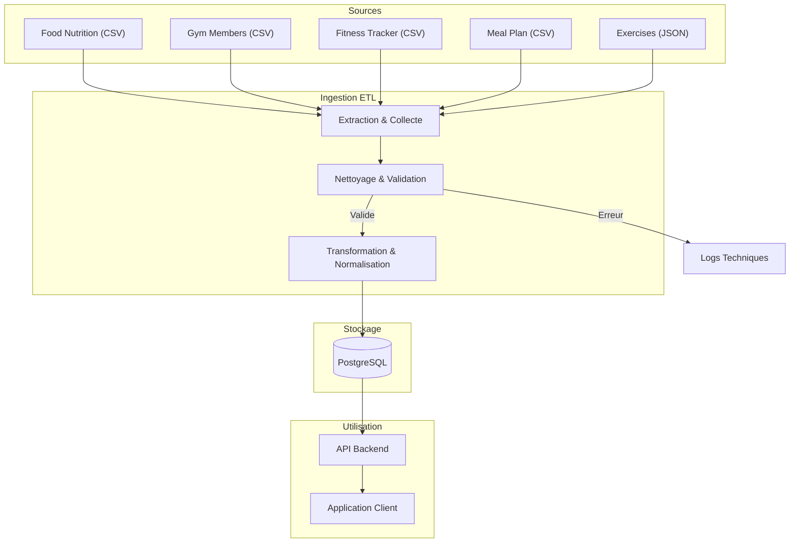
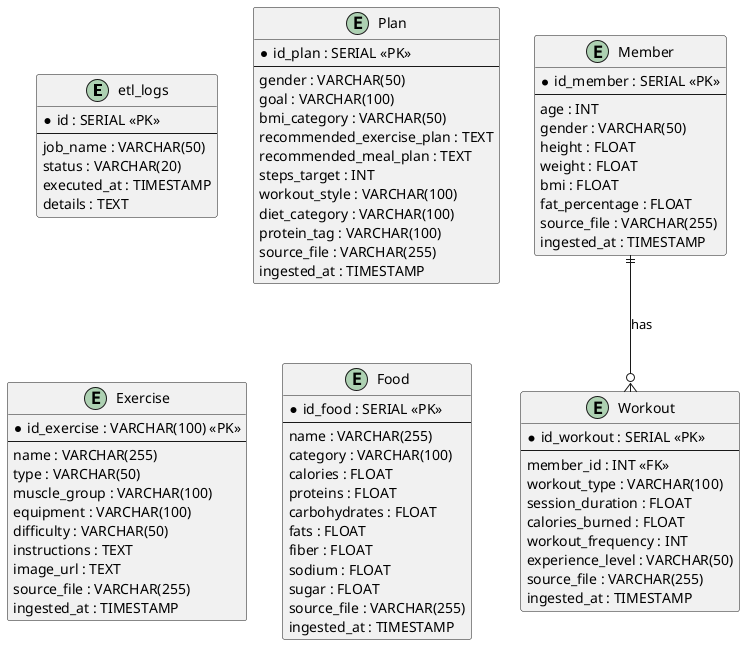

# MSPR---TPRE501


1. # Documentation des données et flux
Ce rapport recense l'ensemble des datasets utilisés pour alimenter la base de données de l'application. Chaque source est décrite avec son origine, son format, et les règles de qualité associées.

### 1.1. Food Nutrition Dataset

- **Origine** : [Kaggle - Food Nutrition Dataset](https://www.kaggle.com/datasets/utsavdey1410/food-nutrition-dataset)
- **Description** : Base de données nutritionnelle complète fournissant des informations détaillées sur les macro et micronutriments d'une large gamme d'aliments.
- **Format** : CSV (`.csv`)
- **Fréquence de mise à jour** : Consistante (selon la source, mise à jour avec de nouveaux aliments et recherches).
- **Règles de Qualité & Traitement** :
  - **Source** : Données structurées avec colonnes définies (Calories, Fats, Vitamins, etc.).
  - **Pipeline ETL** :
    - Vérification des types de données (numériques pour les nutriments).
    - Gestion des valeurs manquantes (null check).
    - Normalisation des unités (g, mg).

### 1.2. Gym Members Exercise Dataset

- **Origine** : [Kaggle - Gym Members Exercise Dataset](https://www.kaggle.com/datasets/valakhorasani/gym-members-exercise-dataset)
- **Description** : Données détaillées sur les routines d'exercice, attributs physiques et métriques de fitness de membres de salle de sport.
- **Format** : CSV (`.csv`)
- **Fréquence de mise à jour** : Statique.
- **Règles de Qualité & Traitement** :
  - **Source** : Contient des données démographiques et de performance (Age, Weight, Heart Rate).
  - **Pipeline ETL** :
    - Standardisation des noms de colonnes.
    - Vérification de la cohérence des métriques (ex: BPM max > BPM avg).

### 1.3. Fitness Tracker Dataset

- **Origine** : [Kaggle - Fitness Tracker Dataset](https://www.kaggle.com/datasets/nadeemajeedch/fitness-tracker-dataset)
- **Description** : Données synthétiques sur les métriques de fitness, routines et paramètres de santé, idéales pour l'analyse de tendances.
- **Format** : CSV (`.csv`)
- **Fréquence de mise à jour** : Statique (Jeu de données synthétique).
- **Règles de Qualité & Traitement** :
  - **Source** : Données synthétiques structurées.
  - **Pipeline ETL** :
    - Fusion potentielle avec d'autres sources de données fitness pour enrichissement.
    - Validation des plages de valeurs (BMI, Fat Percentage).

### 1.4. Meal Plan & Exercise Schedule

- **Origine** : [Kaggle - Meal Plan & Exercise Schedule](https://www.kaggle.com/datasets/kavindavimukthi/meal-plan-and-exercise-schedule-gender-goal-bmi)
- **Description** : Dataset de recommandation mappant des profils utilisateurs (Genre, Objectif, BMI) à des plans de repas et programmes d'exercices.
- **Format** : CSV (`.csv`)
- **Fréquence de mise à jour** : Statique (80k lignes).
- **Règles de Qualité & Traitement** :
  - **Source** : Clean & Structured.
  - **Pipeline ETL** :
    - Parsing des colonnes textuelles (`Exercise Schedule`, `Meal Plan`) pour extraire des entités structurées.
    - Vérification des catégories (Goals, BMI Category).

### 1.5. Free Exercise DB

- **Origine** : [GitHub - Free Exercise DB](https://github.com/yuhonas/free-exercise-db)
- **Description** : Base de données open-source de plus de 800 exercices au format JSON, incluant instructions et images.
- **Format** : JSON (`.json`)
- **Fréquence de mise à jour** : Ad-hoc (Open Source, contributions communautaires).
- **Règles de Qualité & Traitement** :
  - **Source** : Validation par Schema JSON.
  - **Pipeline ETL** :
    - Validation contre le schéma JSON attendu (champs requis : `id`, `name`, `primaryMuscles`, etc.).
    - Traitement des chemins d'images pour assurer l'accessibilité.
    - Aplatissement (Flattening) des structures imbriquées pour le stockage relationnel.
    - 

Ce diagramme illustre le cycle de vie de la donnée :


---
2. # Pipelines ETL opérationnels
Le pipeline ETL est contenue dans le container mspr-etl à l'aide du docker compose avec gestion des volumes pour la persistance des donnée

Le pipeline suit une architecture modulaire classique (Extract, Transform, Load) :

### a. Extraction (`src/etl/extractors.py`)

- **Sources** : Récupération des données depuis des fichiers **CSV** et **JSON**.
- **Traçabilité** : Chaque ligne ingérée conserve le nom du fichier source (`source_file`).

### b. Transformation (`src/etl/transformers.py`)

- **Nettoyage** :
  - Gestion des valeurs manquantes (remplacement par la médiane ou valeurs par défaut).
  - Normalisation des textes (minuscules, suppression d'espaces).
- **Parsing** : Extraction d'informations structurées (nombre de pas, type de régime) depuis des champs texte complexes via Regex.
- **Qualité** : Validation des schémas de données avant chargement.

### c. Chargement (`src/etl/loaders.py`)

- **Destination** : Base de données PostgreSQL.
- **Mode** : Ajout des données avec gestion des erreurs d'insertion.
- 

L'exécution du pipeline est entièrement automatisée via un script Python (`src/scheduler.py`).

- **Fréquence** : Exécution quotidienne planifiée à **02:00**.

Une stratégie de logs a été mise en place pour couvrir à la fois les besoins techniques et opérationnels :

1. **Logs Techniques (Fichier & Console)** :
   
   - **Cible** : `src/logs/etl.log` et sortie standard Docker.
   - **Contenu** : Détails d'exécution, traces d'erreurs (stack traces), informations de débogage.

2. **Logs Opérationnels (Base de Données)** :
   
   - **Cible** : Table `etl_logs` dans PostgreSQL.
   - **Contenu** : Statut global du job (`STARTED`, `SUCCESS`, `FAILED`), horodatage, message d'erreur synthétique.

---
3. # Jeux de données nettoyés et exploitables
Les données issues du pipeline sont nettoyées, normalisées et prêtes pour l'analyse ou l'IA.

**Accès aux fichiers :**

> Les jeux de données consolidés (CSV) sont disponibles dans le dossier `src/cleaned_data/`


---
4. # Base de données relationnelle et scripts associés
Le stockage est assuré par une base de données relationnelle **PostgreSQL**.



La base de données est **auto-déployée** via Docker.

Le script `init.sql` est monté dans le conteneur PostgreSQL (`/docker-entrypoint-initdb.d/`). Il crée automatiquement les tables au premier démarrage si elles n'existent pas.

```sql
-- Initial database setup
-- Tables will be created here
CREATE TABLE IF NOT EXISTS etl_logs (
    id SERIAL PRIMARY KEY,
    job_name VARCHAR(50),
    status VARCHAR(20),
    executed_at TIMESTAMP DEFAULT CURRENT_TIMESTAMP,
    details TEXT
);

CREATE TABLE IF NOT EXISTS "Plan" (
    id_plan SERIAL PRIMARY KEY,
    gender VARCHAR(50),
    goal VARCHAR(100),
    bmi_category VARCHAR(50),
    recommended_exercise_plan TEXT,
    recommended_meal_plan TEXT,
    steps_target INT,
    workout_style VARCHAR(100),
    diet_category VARCHAR(100),
    protein_tag VARCHAR(100),
    source_file VARCHAR(255),
    ingested_at TIMESTAMP DEFAULT CURRENT_TIMESTAMP
);

CREATE TABLE IF NOT EXISTS "Exercise" (
    id_exercise VARCHAR(100) PRIMARY KEY,
    name VARCHAR(255),
    type VARCHAR(50),
    muscle_group VARCHAR(100),
    equipment VARCHAR(100),
    difficulty VARCHAR(50),
    instructions TEXT,
    image_url TEXT,
    source_file VARCHAR(255),
    ingested_at TIMESTAMP DEFAULT CURRENT_TIMESTAMP
);

CREATE TABLE IF NOT EXISTS "Member" (
    id_member SERIAL PRIMARY KEY,
    age INT,
    gender VARCHAR(50),
    height FLOAT,
    weight FLOAT,
    bmi FLOAT,
    fat_percentage FLOAT,
    source_file VARCHAR(255),
    ingested_at TIMESTAMP DEFAULT CURRENT_TIMESTAMP
);

CREATE TABLE IF NOT EXISTS "Food" (
    id_food SERIAL PRIMARY KEY,
    name VARCHAR(255),
    category VARCHAR(100),
    calories FLOAT,
    proteins FLOAT,
    carbohydrates FLOAT,
    fats FLOAT,
    fiber FLOAT,
    sodium FLOAT,
    sugar FLOAT,
    source_file VARCHAR(255),
    ingested_at TIMESTAMP DEFAULT CURRENT_TIMESTAMP
);

CREATE TABLE IF NOT EXISTS "Workout" (
    id_workout SERIAL PRIMARY KEY,
    member_id INT, -- Implicit relation
    workout_type VARCHAR(100),
    session_duration FLOAT,
    calories_burned FLOAT,
    workout_frequency INT,
    experience_level VARCHAR(50),
    source_file VARCHAR(255),
    ingested_at TIMESTAMP DEFAULT CURRENT_TIMESTAMP,
    FOREIGN KEY (member_id) REFERENCES "Member"(id_member)
);

```
---
5. # API REST documentée

6. # Interface web et tableau de bord interactif 

7. # Rapport technique et guide de déploiement 

8. # Support de soutenance 
