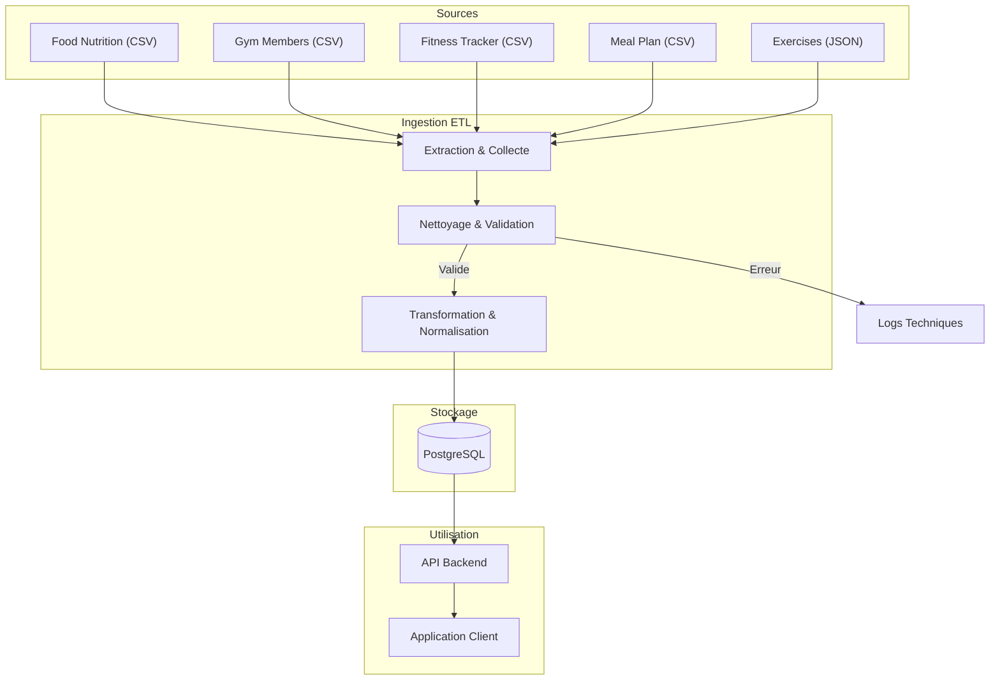
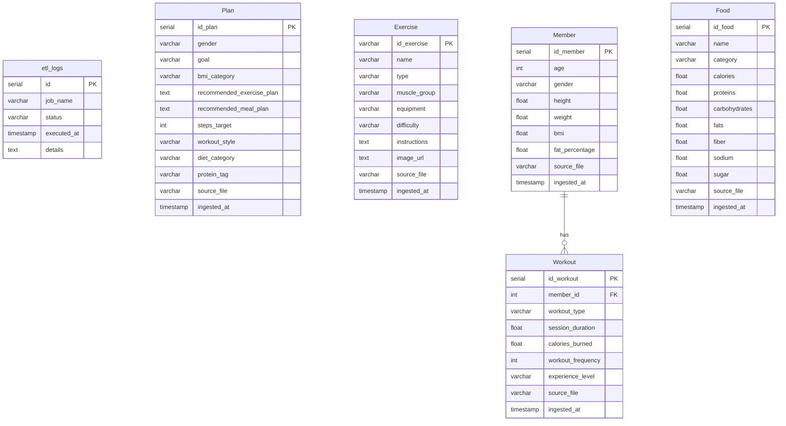
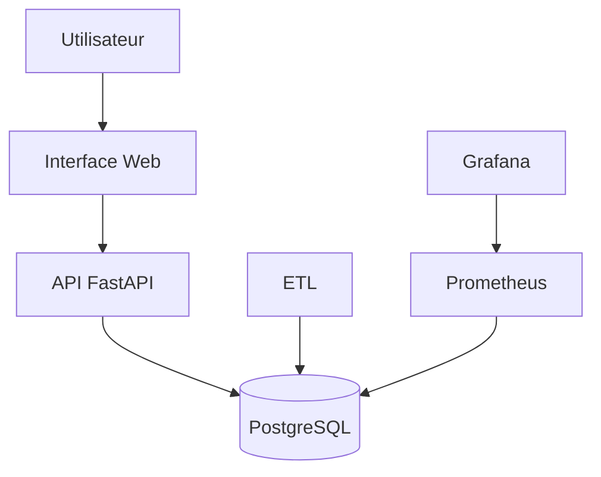

# MSPR---TPRE501


1. # Documentation des données et flux
Ce rapport recense l'ensemble des datasets utilisés pour alimenter la base de données de l'application. Chaque source est décrite avec son origine, son format, et les règles de qualité associées.

### 1.1. Food Nutrition Dataset

- **Origine** : [Kaggle - Food Nutrition Dataset](https://www.kaggle.com/datasets/utsavdey1410/food-nutrition-dataset)
- **Description** : Base de données nutritionnelle complète fournissant des informations détaillées sur les macro et micronutriments d'une large gamme d'aliments.
- **Format** : CSV (`.csv`)
- **Fréquence de mise à jour** : Consistante (selon la source, mise à jour avec de nouveaux aliments et recherches).
- **Règles de Qualité & Traitement** :
  - **Source** : Données structurées avec colonnes définies (Calories, Fats, Vitamins, etc.).
  - **Pipeline ETL** :
    - Vérification des types de données (numériques pour les nutriments).
    - Gestion des valeurs manquantes (null check).
    - Normalisation des unités (g, mg).

### 1.2. Gym Members Exercise Dataset

- **Origine** : [Kaggle - Gym Members Exercise Dataset](https://www.kaggle.com/datasets/valakhorasani/gym-members-exercise-dataset)
- **Description** : Données détaillées sur les routines d'exercice, attributs physiques et métriques de fitness de membres de salle de sport.
- **Format** : CSV (`.csv`)
- **Fréquence de mise à jour** : Statique.
- **Règles de Qualité & Traitement** :
  - **Source** : Contient des données démographiques et de performance (Age, Weight, Heart Rate).
  - **Pipeline ETL** :
    - Standardisation des noms de colonnes.
    - Vérification de la cohérence des métriques (ex: BPM max > BPM avg).

### 1.3. Fitness Tracker Dataset

- **Origine** : [Kaggle - Fitness Tracker Dataset](https://www.kaggle.com/datasets/nadeemajeedch/fitness-tracker-dataset)
- **Description** : Données synthétiques sur les métriques de fitness, routines et paramètres de santé, idéales pour l'analyse de tendances.
- **Format** : CSV (`.csv`)
- **Fréquence de mise à jour** : Statique (Jeu de données synthétique).
- **Règles de Qualité & Traitement** :
  - **Source** : Données synthétiques structurées.
  - **Pipeline ETL** :
    - Fusion potentielle avec d'autres sources de données fitness pour enrichissement.
    - Validation des plages de valeurs (BMI, Fat Percentage).

### 1.4. Meal Plan & Exercise Schedule

- **Origine** : [Kaggle - Meal Plan & Exercise Schedule](https://www.kaggle.com/datasets/kavindavimukthi/meal-plan-and-exercise-schedule-gender-goal-bmi)
- **Description** : Dataset de recommandation mappant des profils utilisateurs (Genre, Objectif, BMI) à des plans de repas et programmes d'exercices.
- **Format** : CSV (`.csv`)
- **Fréquence de mise à jour** : Statique (80k lignes).
- **Règles de Qualité & Traitement** :
  - **Source** : Clean & Structured.
  - **Pipeline ETL** :
    - Parsing des colonnes textuelles (`Exercise Schedule`, `Meal Plan`) pour extraire des entités structurées.
    - Vérification des catégories (Goals, BMI Category).

### 1.5. Free Exercise DB

- **Origine** : [GitHub - Free Exercise DB](https://github.com/yuhonas/free-exercise-db)
- **Description** : Base de données open-source de plus de 800 exercices au format JSON, incluant instructions et images.
- **Format** : JSON (`.json`)
- **Fréquence de mise à jour** : Ad-hoc (Open Source, contributions communautaires).
- **Règles de Qualité & Traitement** :
  - **Source** : Validation par Schema JSON.
  - **Pipeline ETL** :
    - Validation contre le schéma JSON attendu (champs requis : `id`, `name`, `primaryMuscles`, etc.).
    - Traitement des chemins d'images pour assurer l'accessibilité.
    - Aplatissement (Flattening) des structures imbriquées pour le stockage relationnel.
    - 

Ce diagramme illustre le cycle de vie de la donnée :


---
2. # Pipelines ETL opérationnels
Le pipeline ETL est contenue dans le container mspr-etl à l'aide du docker compose avec gestion des volumes pour la persistance des donnée

Le pipeline suit une architecture modulaire classique (Extract, Transform, Load) :

### a. Extraction (`src/etl/extractors.py`)

- **Sources** : Récupération des données depuis des fichiers **CSV** et **JSON**.
- **Traçabilité** : Chaque ligne ingérée conserve le nom du fichier source (`source_file`).

### b. Transformation (`src/etl/transformers.py`)

- **Nettoyage** :
  - Gestion des valeurs manquantes (remplacement par la médiane ou valeurs par défaut).
  - Normalisation des textes (minuscules, suppression d'espaces).
- **Parsing** : Extraction d'informations structurées (nombre de pas, type de régime) depuis des champs texte complexes via Regex.
- **Qualité** : Validation des schémas de données avant chargement.

### c. Chargement (`src/etl/loaders.py`)

- **Destination** : Base de données PostgreSQL.
- **Mode** : Ajout des données avec gestion des erreurs d'insertion.
- 

L'exécution du pipeline est entièrement automatisée via un script Python (`src/scheduler.py`).

- **Fréquence** : Exécution quotidienne planifiée à **02:00**.

Une stratégie de logs a été mise en place pour couvrir à la fois les besoins techniques et opérationnels :

1. **Logs Techniques (Fichier & Console)** :
   
   - **Cible** : `src/logs/etl.log` et sortie standard Docker.
   - **Contenu** : Détails d'exécution, traces d'erreurs (stack traces), informations de débogage.

2. **Logs Opérationnels (Base de Données)** :
   
   - **Cible** : Table `etl_logs` dans PostgreSQL.
   - **Contenu** : Statut global du job (`STARTED`, `SUCCESS`, `FAILED`), horodatage, message d'erreur synthétique.

---
3. # Jeux de données nettoyés et exploitables
Les données issues du pipeline sont nettoyées, normalisées et prêtes pour l'analyse ou l'IA.

**Accès aux fichiers :**

> Les jeux de données consolidés (CSV) sont disponibles dans le dossier `src/cleaned_data/`


---
4. # Base de données relationnelle et scripts associés
Le stockage est assuré par une base de données relationnelle **PostgreSQL**.



La base de données est **auto-déployée** via Docker.

Le script `init.sql` est monté dans le conteneur PostgreSQL (`/docker-entrypoint-initdb.d/`). Il crée automatiquement les tables au premier démarrage si elles n'existent pas.

```sql
-- Initial database setup
-- Tables will be created here
CREATE TABLE IF NOT EXISTS etl_logs (
    id SERIAL PRIMARY KEY,
    job_name VARCHAR(50),
    status VARCHAR(20),
    executed_at TIMESTAMP DEFAULT CURRENT_TIMESTAMP,
    details TEXT
);

CREATE TABLE IF NOT EXISTS "Plan" (
    id_plan SERIAL PRIMARY KEY,
    gender VARCHAR(50),
    goal VARCHAR(100),
    bmi_category VARCHAR(50),
    recommended_exercise_plan TEXT,
    recommended_meal_plan TEXT,
    steps_target INT,
    workout_style VARCHAR(100),
    diet_category VARCHAR(100),
    protein_tag VARCHAR(100),
    source_file VARCHAR(255),
    ingested_at TIMESTAMP DEFAULT CURRENT_TIMESTAMP
);

CREATE TABLE IF NOT EXISTS "Exercise" (
    id_exercise VARCHAR(100) PRIMARY KEY,
    name VARCHAR(255),
    type VARCHAR(50),
    muscle_group VARCHAR(100),
    equipment VARCHAR(100),
    difficulty VARCHAR(50),
    instructions TEXT,
    image_url TEXT,
    source_file VARCHAR(255),
    ingested_at TIMESTAMP DEFAULT CURRENT_TIMESTAMP
);

CREATE TABLE IF NOT EXISTS "Member" (
    id_member SERIAL PRIMARY KEY,
    age INT,
    gender VARCHAR(50),
    height FLOAT,
    weight FLOAT,
    bmi FLOAT,
    fat_percentage FLOAT,
    source_file VARCHAR(255),
    ingested_at TIMESTAMP DEFAULT CURRENT_TIMESTAMP
);

CREATE TABLE IF NOT EXISTS "Food" (
    id_food SERIAL PRIMARY KEY,
    name VARCHAR(255),
    category VARCHAR(100),
    calories FLOAT,
    proteins FLOAT,
    carbohydrates FLOAT,
    fats FLOAT,
    fiber FLOAT,
    sodium FLOAT,
    sugar FLOAT,
    source_file VARCHAR(255),
    ingested_at TIMESTAMP DEFAULT CURRENT_TIMESTAMP
);

CREATE TABLE IF NOT EXISTS "Workout" (
    id_workout SERIAL PRIMARY KEY,
    member_id INT, -- Implicit relation
    workout_type VARCHAR(100),
    session_duration FLOAT,
    calories_burned FLOAT,
    workout_frequency INT,
    experience_level VARCHAR(50),
    source_file VARCHAR(255),
    ingested_at TIMESTAMP DEFAULT CURRENT_TIMESTAMP,
    FOREIGN KEY (member_id) REFERENCES "Member"(id_member)
);

```
---
# 5. API REST documentée

## Vue d'ensemble

L'API REST HealthAI Coach est développée avec **FastAPI** et expose les données de la plateforme stockées dans **PostgreSQL**. Elle tourne sur le port `8000` et génère automatiquement une documentation interactive disponible sur `/docs` (Swagger UI).

**Stack technique :**

| Composant | Technologie |
|---|---|
| Framework API | FastAPI + Uvicorn |
| ORM | SQLAlchemy |
| Base de données | PostgreSQL 15 |
| Validation des données | Pydantic v2 |
| Export CSV | Pandas |
| Monitoring | Prometheus + Grafana |
| Containerisation | Docker / Docker Compose |

---

## Accès à l'API

L'API est accessible sur : `http://localhost:8000`
La documentation Swagger est accessible sur : `http://localhost:8000/docs`

## Sécurité

Les routes de **lecture** (GET) sont **publiques**.
Les routes d'**écriture** (POST, PUT, DELETE) et d'**export CSV** sont **protégées par une API Key**.

**Header à fournir pour les routes protégées :**

```
X-API-Key: healthai_key
```

En cas de clé invalide ou absente → réponse `403 Forbidden`.

---

## Endpoints

### Members — `/members`

Profils utilisateurs (âge, genre, poids, taille, IMC, % de graisse corporelle).

| Méthode | Route | Auth | Description |
|---|---|---|---|
| GET | `/members/` | Non | Liste des membres (pagination `skip`/`limit`) |
| GET | `/members/{id}` | Non | Détail d'un membre |
| POST | `/members/` | Oui | Créer un membre |
| PUT | `/members/{id}` | Oui | Modifier un membre |
| DELETE | `/members/{id}` | Oui | Supprimer un membre |

---

### Foods — `/foods`

Base nutritionnelle : aliments avec leurs valeurs nutritionnelles (calories, protéines, glucides, lipides, fibres, sodium, sucre).

| Méthode | Route | Auth | Description |
|---|---|---|---|
| GET | `/foods/` | Non | Liste des aliments |
| GET | `/foods/{id}` | Non | Détail d'un aliment |
| POST | `/foods/` | Oui | Créer un aliment |
| PUT | `/foods/{id}` | Oui | Modifier un aliment |
| DELETE | `/foods/{id}` | Oui | Supprimer un aliment |

---

### Exercises — `/exercises`

Catalogue d'exercices sportifs (type, groupe musculaire, équipement requis, niveau de difficulté, instructions).

> La clé primaire est une chaîne de caractères (`id_exercise`), pas un entier.
> La création vérifie l'unicité de l'id → `409 Conflict` si l'exercice existe déjà.

| Méthode | Route | Auth | Description |
|---|---|---|---|
| GET | `/exercises/` | Non | Liste des exercices |
| GET | `/exercises/{id}` | Non | Détail d'un exercice |
| POST | `/exercises/` | Oui | Créer un exercice |
| PUT | `/exercises/{id}` | Oui | Modifier un exercice |
| DELETE | `/exercises/{id}` | Oui | Supprimer un exercice |

---

### Workouts — `/workouts`

Sessions d'entraînement liées aux membres (type, durée, calories brûlées, fréquence, niveau d'expérience).

| Méthode | Route | Auth | Description |
|---|---|---|---|
| GET | `/workouts/` | Non | Liste des sessions |
| GET | `/workouts/{id}` | Non | Détail d'une session |
| GET | `/workouts/member/{member_id}` | Non | Toutes les sessions d'un membre |
| POST | `/workouts/` | Oui | Créer une session (vérifie que le membre existe) |
| PUT | `/workouts/{id}` | Oui | Modifier une session |
| DELETE | `/workouts/{id}` | Oui | Supprimer une session |

---

### Plans — `/plans`

Plans personnalisés de santé (objectif, catégorie IMC, programme sportif et alimentaire recommandé).

| Méthode | Route | Auth | Description |
|---|---|---|---|
| GET | `/plans/` | Non | Liste des plans |
| GET | `/plans/{id}` | Non | Détail d'un plan |
| POST | `/plans/` | Oui | Créer un plan |
| PUT | `/plans/{id}` | Oui | Modifier un plan |
| DELETE | `/plans/{id}` | Oui | Supprimer un plan |

---

### Export CSV — `/export`

Export des données nettoyées au format CSV. Les colonnes techniques (`source_file`, `ingested_at`) sont exclues de l'export.

| Méthode | Route | Auth | Fichier généré |
|---|---|---|---|
| GET | `/export/members/csv` | Oui | `members.csv` |
| GET | `/export/foods/csv` | Oui | `foods.csv` |
| GET | `/export/exercises/csv` | Oui | `exercises.csv` |
| GET | `/export/workouts/csv` | Oui | `workouts.csv` |
| GET | `/export/plans/csv` | Oui | `plans.csv` |

---

### Monitoring — Endpoints système

| Route | Auth | Description |
|---|---|---|
| `GET /` | Non | Vérifie que l'API est en ligne |
| `GET /metrics` | Non | Métriques Prometheus |
| `GET /docs` | Non | Documentation Swagger interactive |
| `GET /redoc` | Non | Documentation ReDoc |


# 6. Interface web et tableau de bord interactif

### 6.1 Présentation générale

L’interface web et le tableau de bord sont accessibles via le service **Grafana** (port 3000) et, si présent, une interface utilisateur développée en FastAPI (port 8000).

#### Objectifs :
- Visualiser les données agrégées (nutrition, activité, membres, plans)
- Suivre l’état de santé de la base et des pipelines ETL
- Offrir une expérience utilisateur simple pour la consultation et l’analyse

### 6.2 Technologies utilisées
- **Grafana** : visualisation de données, dashboards interactifs
- **Prometheus** : collecte des métriques (requêtes, erreurs, temps de réponse)
- **FastAPI** : endpoints REST pour l’interface web


### 6.3 Fonctionnalités principales

#### Dashboards Grafana
- **Vue d’ensemble PostgreSQL** :
    - Nombre de requêtes, connexions actives, temps de réponse
    - Espace disque utilisé, taux d’erreur
- **Suivi ETL** :
    - Statut des jobs ETL (succès/échec)
    - Volume de données traitées par jour
- **Analyse nutritionnelle** :
    - Répartition des aliments par catégorie
    - Top 10 des aliments les plus caloriques
- **Suivi des membres** :
    - Nombre de membres actifs
    - Répartition par genre, âge, IMC

#### Interface web utilisateur (si développée)
- **Recherche d’aliments** : filtrage par nom, catégorie, calories
- **Consultation des plans d’entraînement** : affichage personnalisé selon profil
- **Visualisation des progrès** : graphiques d’évolution (poids, calories brûlées)
- **Export de données** : téléchargement CSV/JSON

### 6.4 Parcours utilisateur
1. **Connexion à Grafana** :
     - URL : http://localhost:3000
     - Identifiants par défaut : admin / admin123 (à modifier en prod)
2. **Navigation dans les dashboards** :
     - Sélection du dashboard « Postgres Overview »
     - Consultation des métriques clés
3. **Utilisation de l’interface web** (si présente) :
     - Accès via http://localhost:8000 ou http://localhost:8000/docs pour l’API
     - Recherche, consultation, export de données

### 6.5 Exemples de dashboards (captures d’écran à insérer)


### 6.6 Cas d’usage
- **Administrateur** : surveille la santé du système, détecte les anomalies
- **Data analyst** : exporte les données pour analyses avancées

### 6.7 Bonnes pratiques et sécurité
- Restreindre l’accès à Grafana en production (utilisateurs, mots de passe forts)
- Sécuriser les endpoints de l’API (authentification, CORS)
- Sauvegarder régulièrement les dashboards personnalisés

---
7. # Rapport technique et guide de déploiement

### 7.1 Architecture technique

#### Schéma global
L’architecture repose sur une approche modulaire et conteneurisée :

- **Docker Compose** orchestre l’ensemble des services (API, ETL, base de données, monitoring, dashboard)
- **FastAPI** pour l’API REST
- **PostgreSQL** pour la base de données relationnelle
- **ETL Python** pour l’ingestion et la transformation des données
- **Grafana & Prometheus** pour la supervision et la visualisation

Exemple de schéma :



#### Choix techniques
- Conteneurisation pour la portabilité et la reproductibilité
- Utilisation de variables d’environnement pour la configuration
- Séparation des responsabilités (API, ETL, monitoring)

---

### 7.2 Procédure d’installation et de déploiement

#### Prérequis
- Docker & Docker Compose installés
- Accès au dépôt du projet (git clone ...)
- Fichier `.env` correctement renseigné (voir `.env.example`)

#### Étapes d’installation
1. **Cloner le dépôt**
	 ```bash
	 git clone https://github.com/SuiramX/MSPR---TPRE501
	 cd MSPR---TPRE501
	 git checkout main
	 ```
2. **Configurer les variables d’environnement**
	 - Copier `.env.example` en `.env` et adapter les valeurs
3. **Lancer les services**
	 ```bash
	 docker-compose up -d
	 ```
4. **Vérifier le bon démarrage**
	 ```bash
	 docker-compose ps
	 docker-compose logs app
	 docker-compose logs etl
	 ```

#### Exemples de variables d’environnement
```env
DATABASE_URL=postgresql://user:logg/mspr
POSTGRES_USER=logg
POSTGRES_PASSWORD=paasss
GF_SECURITY_ADMIN_USER=admin
GF_SECURITY_ADMIN_PASSWORD=apass
```

#### Commandes utiles
- Arrêter les services : `docker-compose down`
- Rebuild complet : `docker-compose build --no-cache`
- Accéder à un conteneur : `docker-compose exec app bash`

#### Bonnes pratiques
- Ne jamais versionner le fichier `.env` contenant des secrets
- Utiliser des volumes Docker pour la persistance des données
- Documenter chaque modification de configuration

---

### 7.3 Gestion des erreurs et logs

#### Logs applicatifs
- Les logs de l’API et de l’ETL sont accessibles via :
	```bash
	docker-compose logs app
	docker-compose logs etl
	```
- Les logs de la base de données :
	```bash
	docker-compose logs db
	```
- Les logs de Grafana et Prometheus pour la supervision

#### Gestion des exceptions
- Les scripts ETL utilisent un logger Python pour tracer les erreurs critiques
- Exemple dans `main.py` :
	```python
	try:
			engine = get_engine(DB_URL)
			...
	except Exception as e:
			logger.critical(f"Database connection failed: {e}")
			sys.exit(1)
	```
- L’API FastAPI gère les erreurs HTTP avec des réponses structurées

#### Monitoring
- Grafana permet de visualiser l’état des services et de la base
- Prometheus collecte les métriques (requêtes, erreurs, etc.)

---

### 7.4 Tests et validation

#### Procédures de test
- **Tests unitaires** sur les fonctions ETL (extraction, transformation)
- **Tests d’intégration** : vérification du pipeline complet (données → base → API)
- **Tests API** : utilisation de `pytest` ou `httpie`/`curl` pour tester les endpoints

#### Exemples de tests
```bash
# Test d’un endpoint API
curl -X GET http://localhost:8000/food

# Test d’un script ETL
docker-compose exec etl python main.py
```

#### Jeux de données de validation
- Fichiers CSV de test dans le dossier `data/`
- Résultats attendus : nombre de lignes, cohérence des champs

#### Validation du déploiement
- Checklist :
	- Tous les conteneurs sont up (`docker-compose ps`)
	- L’API répond sur le port 8000
	- Les dashboards Grafana sont accessibles sur le port 3000
	- Les données sont bien présentes dans la base PostgreSQL

---

---

## 8. Support de soutenance

### 8.1 Slides de présentation
- Plan, points clés, démonstration

### 8.2 Argumentaire métier et technique
- Justification des choix, valeur ajoutée

### 8.3 Questions/réponses anticipées
- Liste de questions potentielles et réponses préparées

---

## Annexes
- Liens vers les sources, scripts, jeux de données, documentation technique
- Glossaire des termes techniques

---
